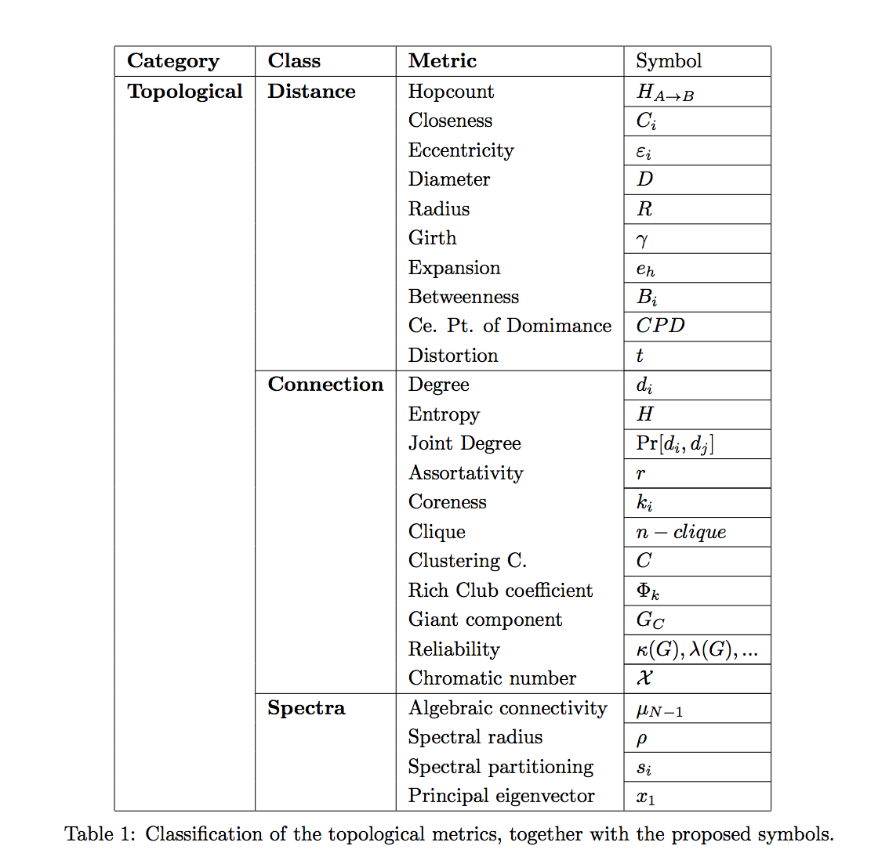

# Graph Metrics
이 마크다운에서는 어떤 Graph의 topological features를 나타내는 여러 척도(metrics)에 대한 개념적인 메모를 포함합니다.  
구체적인 계산 방식 등은 추가적인 자료 (wiki, survey papers)를 참조해주세요.  
정리는 [출처](https://www.nas.ewi.tudelft.nl/people/Piet/papers/TUDreport20111111_MetricList.pdf) 를 바탕으로 이루어졌습니다.

## Classification of Graph Metrics (Overview)  
아래와 같이, graph metric은 1) Distance 기반, 2) Connection 기반, 3) Spectra 기반 방식으로 분류될 수 있으며,  
각각의 metric 마다 서로 다른 특징을 갖습니다.

## 1. Distance Class
### 1.1 Hopcount (H)
두 노드 (A -> B) 를 연결하는 **가장 짧은 경로 (shortest path)의 '경로 길이'**  
Hopcount distribution Pr[H=k] (두 random node 사이의 hopcount가 k일 확률)은 주로 routing algorithms에서 사용되며,  
robustness of the network to worms를 평가할 때도 사용되기도 한다.  
(worm이 네트워크에 들어왔을 때, 얼마나 빨리 다른 노드에 도달하는 지 등을 알 수 있기 때문)  

### 1.2 Closeness  
어떤 노드 i의 closeness C_i 는 노드 i에서 다른 노드로 이동할 때 걸리는 경로의 길이 (hopcount)의 평균을 의미한다.  
주로, **total hopcount의 역수** 로 정의해서 사용하기도 한다.  

### 1.3 Eccentricity, Diameter, Radius
#### Eccentricity
어떤 노드 i의 Eccentricity는 노드 i에서 다른 노드까지의 hopcount 중 **가장 큰 값 (maximum hopcount)**  

#### Diameter
그래프에 소속된 노드들의 Eccentricity 중 가장 큰 값 (maximum eccentricity)  
그래프 내 가장 큰 값의 hopcount와 동일  

#### Radius
그래프에 소속된 노드들의 Eccentricity 중 가장 작은 값 (minimum eccentricity)  
min_i max_j (H(i,j))  

### 1.4 Persistence
"The smallest number of links whose removal increases the diameter or disconnect the graph."  
즉, 그래프 내 diameter를 증가시키기 위해 제거해야할 링크의 수를 의미.  
몇 개의 링크를 제거하면, 그래프 안의 노드들의 최대 거리가 길어지는지.  

### 1.5 Girth
"The hopcount of the shortest cycle contained in the graph."  
Cycle은 중복된 노드 없이, 자기 자신으로 돌아오는 경로를 의미한다. (acyclic인 경우 infinite)  

주로 네트워크에서 loop가 생성되는 것을 방지하기 위해 사용될 수는 있지만, 사용하는 경우가 드물다고 한다.  

### 1.6 Expansion
"The average fraction of nodes in the graph that fall within a ball of radius h"  
어떤 노드 i의 expansion은 (hopcount의 크기가 h보다 작은 다른 노드들의 개수)/(전체 노드 수의 제곱)  
말 그대로, 특정 노드의 ball (해석학에서의 개념)넓이의 비율.  

The expansion of a node provides information about the global graph reachability from a local point of view.  

### 1.7 Betweenness
"The number of shortest paths between pairs of nodes that traverse a node k."  
그래프 내 존재하는 shortest paths 중 특정 노드 k를 지나가는 paths의 수.  

### 1.8 Central Point of Dominance
CPD = (Betweenness 최댓값 - 특정 node의 betweenness)의 합 / (N-1)  

## 2. Connection Class

### 2.1 Degree
노드 i의 degree = 노드 i에 연결된 edge들 개수(또는 weight)의 합  
그래프 전체의 Topological 특성을 분석할 때는 degree distribution을 주로 활용.  

### 2.2 Joint Degree Distribution (JDD)  
어떤 random pair of nodes의 degree가 각각 k1, k2일 확률 Pr[D1=k1, D2=k2]  
"How many nodes of a given degree are found in a network, Correlations of degrees of nodes located at distance 1."

### 2.3 Assortativity
Correlations among degrees (Pearson correlation coefficient of the degrees at either ends of each link)  
High degree 노드가 high degree 노드와 주로 연결되어 있는지, low degree 노드와 주로 연결되어 있는지.  

### 2.4 Coreness
k-core는 k보다 degree가 적은 노드들을 연속적으로 제거했을 때 나오는 subgraph  
어떤 노드의 coreness: "maximum k such that this node is present in the k-core graph, but removed from the k+1".  
Indicator of node centrality (since it measures how deep within the networks a node is located)  

### 2.5 Cliques and n-cliques
* Clique: subset of nodes such that "all elements in the clique are fully connected"  
* n-clique: subset of nodes such that "all elements in the clique are reachable within n hops"  

Cliques를 찾는 것은 NP-hard 문제.  
The knowledge about subgraphs with clique features within a network can decrease the complexity of algorithms designed for such network.  

### 2.6 Clustering Coefficient
Node i의 Clustering coefficient는 노드 i와 그 이웃 사이의 cliquishiness를 측정한다.
(노드 i에 연결된 링크 수)/(노드 i를 포함한 이웃들 사이에서 가능한 모든 링크 수)  

어떤 그래프 G의 clustering coefficient는 모든 노드 i의 local clustering coefficient의 평균을 의미.  
이는, 어떤 노드의 두 이웃이, 서로 직접 이웃일 확률을 나타내며, 1에 가까울 수록 fully connected 됨을 의미한다.  

### 2.7 Rich Club Coefficient
degree가 k보다 큰 nodes의 집합을 S(k)라고 정의할 수 있다. (k-club members)  
Rich-club coefficient: ratio of the number of links connecting the club members over the maximum number of allowable links in S(k), which measures how well the rich nodes know each others.  
즉, (k-club member 끼리 연결된 링크 수)/(k-club member 사이에서 가능한 모든 링크 수).  

Rich-club phenomenon, increasing k, cliques

### 2.8 Giant Component
Strongly connected components: maximal subgraph of a directed graph s.t. for every pair of nodes, there are a directed path, and inverse path.  

If a network is robust, when the number of giant component is not changes after a nodes or links is randomly removed.

### 2.9 Reliability

## 3. Spectra Class
### 3.1  Algebraic Connectivity
Algebraic connectivity: the **second smallest** eigenvalue of the Laplacian matrix.  
For large N, the distribution of the algebraic connectivity grows linearly with the minimum node degree.

It is related to the speed of solving consensus problems in networks, and it's a lower bound for the vertex connectivity.

### 3.2 Spectral Radius
Spectral radius of A is max eigenvalue.  

### 3.3 Fiedleer vector
The eigenvector corresponding to the second smallest eigenvalue of the Laplacian.  
Spectral partitioning methods have been developed to split the nodes of a graph into two groups.  
(s.t. the # of links btw the groups is minimized.)

### 3.4 Principal eigenvector
Eigenvector of the largest eigenvalue (spectral radius).  
It is related to node centrality or relative importance of nodes in a graph.  
